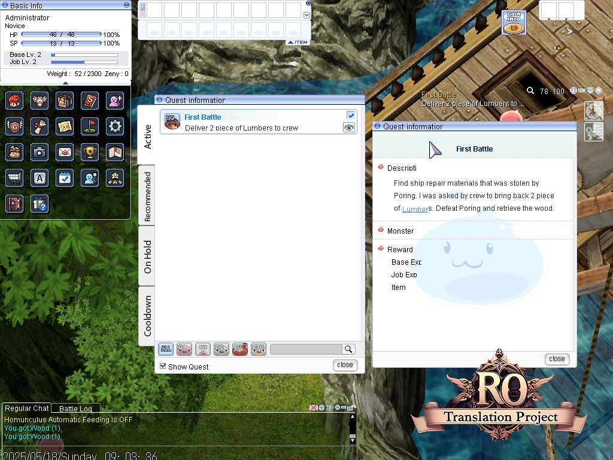

# 🎮 Easy RO Docker

Welcome to **Easy RO Docker**, a fully containerized Ragnarok Online server setup using Docker. This stack includes:

- 🐋 MariaDB for your game data
- ⚙️ rAthena server engine
- 🕹️ FluxCP web control panel
- 🧪 phpMyAdmin for easy database access

---

## 🖼️ Preview



## 🚀 Getting Started

### 1. 📦 Install Docker

Make sure you have the **latest version of Docker** and Docker Compose:

- [Install Docker](https://docs.docker.com/get-docker/)
- [Install Docker Compose](https://docs.docker.com/compose/install/)

---

### 2. 🧬 Clone the Repository

```bash
git clone https://github.com/your-username/easy-ro-docker.git
cd easy-ro-docker
```

### 3. 🛠️ Build Docker Images

Build your custom server and control panel images:

```bash
docker build -t rathena:0.0.1 ./rathena
docker build -t fluxcp:0.0.1 ./fluxcp
```

Make sure you set your IP, database passwords, rates, and packet version correctly.

### 5. ⚙️ Setup Environment Variables

Copy the sample .env and customize it:

```bash
cp .env.example .env
nano .env
```

Make sure you set your IP, database passwords, rates, and packet version correctly.

### 5. 📡 Launch the Server

```bash
docker compose up
```

That’s it! Your server should now be running with:

📦 rAthena at ports 5121, 6121, 6900

🌐 FluxCP on http://localhost:5123

🧪 phpMyAdmin on http://localhost:5124

## 🧹 Maintenance

To stop and remove all containers:

```bash
docker compose down
```

To rebuild after making code/config changes:

```bash
docker compose build --no-cache
```

📁 Folder Structure

```text
easy-ro-docker/
├── rathena/             # Custom rAthena image & cache
├── fluxcp/              # FluxCP panel image & config
├── mariadb/             # MySQL data volume
├── .env                 # Environment config
├── docker-compose.yml   # Docker setup
└── README.md
```

## 🧩 Setup the Game Client
1. Download the latest English RO client from the [ROClient_en GitHub Repository.](https://github.com/hiphop9/ROClient_en)

2. Download the Full Client (~3.9 GB) and the patched EXE.

3. Extract the client and and put patched client exe along with other client executables

4. Open data/clientinfo.xml in your downloaded client app and configure it to connect to your server:

```xml
<?xml version="1.0" encoding="euc-kr" ?>
<clientinfo>
  <desc>Ragnarok Client Information</desc>
  <servicetype>korea</servicetype>
  <servertype>primary</servertype>
  <connection>
    <display>Local</display>
    <address>192.168.0.102</address>
    <port>6900</port>
    <version>55</version>
    <langtype>1</langtype>
    <registrationweb>http://192.168.0.102:5023</registrationweb>
    <loading>
      <image>loading00.jpg</image>
      <image>loading01.jpg</image>
      <image>loading02.jpg</image>
      <image>loading03.jpg</image>
      <image>loading04.jpg</image>
      <image>loading05.jpg</image>
      <image>loading06.jpg</image>
    </loading>
    <aid>
      <admin>1</admin>
      <admin>2000000</admin>
    </aid>
  </connection>
</clientinfo>
```


## ❤️ Credits

- [rAthena](https://github.com/rathena/rathena)
- [FluxCP](https://github.com/rathena/FluxCP)
- [phpMyAdmin](https://www.phpmyadmin.net/)
- [Docker 🐋](https://www.docker.com/)

## Notes

For firsttime run, execute this script using phpmyadmin to register an admin user

```sql
INSERT INTO `login` (`account_id`, `userid`, `user_pass`, `sex`, `email`, `group_id`, `state`, `unban_time`, `expiration_time`, `logincount`, `lastlogin`, `last_ip`, `birthdate`, `character_slots`, `pincode`, `pincode_change`, `vip_time`, `old_group`, `web_auth_token`, `web_auth_token_enabled`) VALUES
(2000000, 'admin', 'admin123', 'F', 'admin@athena.com', 99, 0, 0, 0, 5, '2025-05-18 01:17:10', '192.168.0.100', NULL, 0, '1412', 1747530571, 0, 0, 'ce6a6fa2899bbf24', 0);

```
